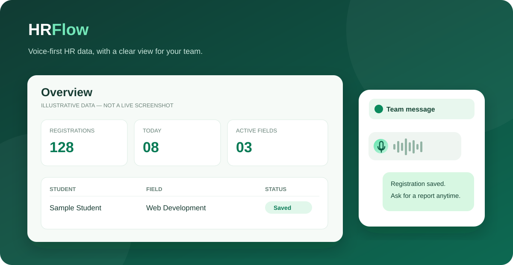

# HRFlow — WhatsApp Voice Automation & HR Dashboard

<p align="center"></p>


HRFlow is a local-first prototype for turning Urdu, Roman Urdu, and English WhatsApp voice notes into structured registration records. It also answers HR questions from saved data and provides a private, mobile-friendly dashboard for authorized team members.

> **Status:** Functional local prototype, not an internet-hosted production service. The WhatsApp adapter uses Selenium and a dedicated Chrome profile; it must stay on a logged-in computer. The dashboard runs locally until secure hosting is configured.

## What it does

- Transcribes incoming voice notes locally with `faster-whisper` and processes text messages from allowlisted WhatsApp chats.
- Extracts student registrations, fields, dates, and optional attributes such as joining date.
- Assigns supervisors from a configurable field mapping and avoids duplicate name + field + date records.
- Answers count, field, supervisor, individual, salary, and commission queries from SQLite rather than inventing results.
- Synchronizes `Registrations` and `Compensation` worksheets to Google Sheets; local records remain available if sync fails.
- Offers a Django dashboard with login, Admin/HR/Viewer roles, registration entry/edit/search, and reports.

## Architecture

```text
Approved WhatsApp chat ── Selenium ── voice download ── faster-whisper ──┐
                                                                     HR processing
Private dashboard ──────────────── Django forms & permissions ────────────┤
                                                                           ▼
                                                                       SQLite
                                                                           │
                                                                           ▼
                                                                    Google Sheets
```

SQLite is the local source of truth. The dashboard's user accounts live in a separate SQLite database from HR records. Google Sheets is a synchronized view, not the authentication system. Adding a dashboard user **does not** automatically authorize their WhatsApp number; the current bot's allowlist is configured separately.

## Quick start (Windows)

Requires Python 3.10+, Chrome, and an internet connection for WhatsApp Web and Google Sheets. A microphone is not required on the bot computer when voice notes arrive through WhatsApp.

```powershell
python -m venv .venv
.\.venv\Scripts\Activate.ps1
python -m pip install -r requirements.txt
Copy-Item .env.example .env
Copy-Item config.example.json config.json
```

Edit `.env` with your own allowlisted number and, if using Sheets, your spreadsheet ID. Configure real field-to-supervisor assignments in `config.json`. Neither file belongs in Git.

Create the dashboard login database and your first administrator:

```powershell
python dashboard/manage.py migrate
python dashboard/manage.py createsuperuser
python dashboard/manage.py runserver 127.0.0.1:8000 --noreload
```

Open `http://127.0.0.1:8000/` on the same computer. The Django development server is for local use only; do **not** expose it directly to the internet. Admin can add HR members (add/edit) and Viewers (read-only) on the Team page. Salary and commission values are intentionally not shown in this dashboard MVP.

## Google Sheets setup

1. Enable the Google Sheets API and Google Drive API in your own Google Cloud project.
2. Create a service account and download its JSON key as `service-account.json` in the project root.
3. Share your spreadsheet with the service account email as an Editor.
4. Set `GOOGLE_SHEET_ID` in `.env`, then run `python main.py sync`.

The bot owns the `Registrations` and `Compensation` worksheets. Keep access limited to authorized HR staff, especially because compensation data may be present. Manual edits in bot-owned cells may be overwritten by a later sync. Keep backups of `data/` separately.

## WhatsApp bot

Set `WHATSAPP_ALLOWED_NUMBERS` in `.env` to sender numbers in international digits-only format (for example, `923001234567`). The bot's own WhatsApp number is **not** the allowlist entry. Start the bot with:

```powershell
python main.py run
```

Log in via the dedicated bot Chrome window when prompted. Keep that computer and browser session running. A new chat is initially baselined so old messages are not replayed. The adapter identifies incoming messages by message direction and stores processed-message IDs to limit duplicate replies.

Useful local commands:

```powershell
python main.py process "Aaj kitni registrations hui?"
python main.py transcribe path\to\sample.ogg
python main.py records
python main.py sync
python dashboard/manage.py test dashboard_app
python -m unittest discover tests
```

`process` may write records for data-entry text, so use a separate test database or a query-only phrase when experimenting with real data.

## Security and limitations

- **Never commit** `.env`, `service-account.json`, `config.json`, `data/`, audio files, logs, or `chrome-profile/`. They can contain phone numbers, student records, salary data, credentials, and active WhatsApp sessions. The included `.gitignore` excludes them.
- Dashboard passwords are hashed by Django. For any public deployment, set a strong `DASHBOARD_SECRET_KEY`, configure `DASHBOARD_ALLOWED_HOSTS` and HTTPS, use a production web server, and plan a multi-user database and backups.
- The free Selenium/WhatsApp Web adapter is fragile when WhatsApp changes its interface and is not a substitute for an official production messaging integration. Review WhatsApp's current terms before business deployment.
- Voice recognition and rule-based extraction can misunderstand names or dates. Review important records before using them for decisions. The optional Ollama integration in `.env` can help with varied wording but is not required.
- The dashboard does not yet provide browser voice recording, automatic WhatsApp number verification, a public deployment, or a full audit trail. These are future phases, not current features.

## Project layout

| Path | Purpose |
| --- | --- |
| `hrbot/` | WhatsApp adapter, transcription, parsing, reporting, storage, Sheets sync |
| `dashboard/` | Django settings, URLs, templates, entry point |
| `dashboard_app/` | Dashboard forms, permissions, views, tests |
| `config.example.json` / `.env.example` | Safe configuration templates |
| `assets/hrflow-preview.svg` | Synthetic documentation illustration |

No real dashboard screenshot is published because live screenshots can reveal names and HR records.
